# 析数：AI 数据分析工作台

一个面向在线学习运营数据的个人作品集项目。用户可以上传 CSV/XLSX，
查看字段质量和数据预览，并通过自然语言发起受控分析。模型只负责识别
高层分析意图；字段映射、聚合规则、图表规划和业务数字均由服务端的
确定性流程完成。

当前 `v2.0.0` 同时保留 `/api/v1` 兼容能力，并提供完整的 `/api/v2`
分析闭环、SSE 事件、结构化 Artifact、会话持久化和刷新恢复。

## 项目亮点

- **结果驱动工作台**：以数据集概览、指标、表格和图表为主画布，不使用
  固定三栏聊天布局。
- **受控领域工作流**：支持多维分组对比和月度趋势两类在线学习运营分析。
- **确定性计算**：pandas 负责全部统计数字，模型不能生成 Python、SQL、
  工具步骤或图表参数。
- **可验证结论**：Evidence Registry 校验结论引用；模型结论不合法时，
  可以基于已验证证据安全降级。
- **可恢复运行**：AnalysisRun、RunStep、Artifact 和事件持久化；SSE
  提供实时更新，REST 是最终事实来源。
- **安全默认值**：默认 `V2_PROVIDER=fake`，无需密钥和外部网络即可验证
  完整产品链路。

## 支持范围

| 能力 | 当前状态 |
|---|---|
| CSV、XLSX 上传与数据画像 | 已实现 |
| 数据预览、字段与缺失信息 | 已实现 |
| Conversation / Message 多轮历史 | 已实现 |
| AnalysisRun 生命周期与合作式取消 | 已实现 |
| text / metric / table / chart Artifact | 已实现 |
| SSE 实时事件与 REST 恢复 | 已实现 |
| 多维分组对比 | 已实现 |
| 按自然月的分类趋势分析 | 已实现 |
| 任意行业、任意 Python/SQL 分析 | 不支持 |
| Token 级逐字输出 | 不支持 |
| 交互式图表编辑、报告导出、多用户权限 | 不支持 |

## 技术栈

- 后端：Python 3.10、FastAPI 0.115、SQLAlchemy 2、Alembic、Pydantic
- 分析：pandas、NumPy、matplotlib、seaborn
- 模型：DeepSeek（可选）；Fake Provider（默认）
- 前端：React 19、TypeScript 5.9、Vite 7、TanStack Query、Tailwind CSS 4
- 测试：pytest、Vitest、React Testing Library、jsdom
- 存储：SQLite 与本地文件系统

## 核心链路

```mermaid
flowchart LR
    A["上传 CSV / XLSX"] --> B["数据集概览"]
    B --> C["提交分析问题"]
    C --> D["识别高层 AnalysisIntent"]
    D --> E["PlanCompiler 编译固定工作流"]
    E --> F["PlanValidator 执行前校验"]
    F --> G["pandas 确定性计算"]
    G --> H["ChartPlanner 生成图表规格"]
    H --> I["Artifact 与 Evidence 持久化"]
    I --> J["结构化结论或确定性降级"]
    J --> K["SSE 更新与 REST 恢复"]
```



完整架构见 [docs/release/ARCHITECTURE.md](docs/release/ARCHITECTURE.md)。

## 快速开始

### 环境要求

- Python 3.10+
- Node.js 20+（推荐 Node.js 22）
- npm 10+

### 1. 安装

```powershell
git clone https://github.com/SiHuoqwq/ai-data-analyst.git
cd ai-data-analyst

python -m pip install -r requirements.txt
Copy-Item .env.example .env

Set-Location frontend-v2
npm ci
Set-Location ..
```

`.env.example` 默认使用 Fake Provider：

```dotenv
V2_PROVIDER=fake
DATABASE_URL=sqlite:///./app.db
BACKEND_HOST=127.0.0.1
BACKEND_PORT=8000
FRONTEND_ORIGIN=http://localhost:5174
```

不要把真实 API Key 提交到 Git。

### 2. 启动后端

Windows 可以运行：

```powershell
.\start.bat
```

脚本会明确执行数据库迁移。迁移失败时返回非零退出码并停止，不会继续启动
后端。FastAPI 自身不会自动执行 Alembic。

手动启动时：

```powershell
python -m app.migrate
python -m app.run
```

后端地址：`http://127.0.0.1:8000`。

### 3. 启动 Frontend V2

另开一个终端：

```powershell
Set-Location frontend-v2
npm run dev
```

打开 `http://localhost:5174`。

### Windows 演示启动

已安装依赖后，可以在一个 PowerShell 窗口完成迁移并启动正式前后端：

```powershell
.\start-demo.ps1
```

脚本默认强制使用 Fake Provider，运行数据写入仓库外的
`$env:TEMP\xishu-demo-runtime`。页面顶部会根据后端 `/health` 显示当前
Provider。演示结束后运行：

```powershell
.\stop-demo.ps1
```

只有显式执行 `.\start-demo.ps1 -Provider DeepSeek` 才会选择真实模型；
脚本要求 `DEEPSEEK_API_KEY` 已存在于当前环境，但不会打印密钥。

## 数据库迁移安全

- FastAPI 启动只检查 Alembic revision，不自动迁移。
- 缺少 V2 revision 时，`/health` 和 `/api/v2` 返回
  `503 DATABASE_MIGRATION_REQUIRED`。
- `alembic downgrade base` 只能用于新建、可丢弃的临时数据库。
- 真实 `app.db` 在发布验证中只做时间戳和 SHA-256 检查。
- 迁移兼容性验证应对仓库外副本执行 `upgrade head`、重复升级、
  行数检查和 `PRAGMA foreign_key_check`。

详细步骤见 [docs/release/DEPLOYMENT.md](docs/release/DEPLOYMENT.md)。

## 运行测试

后端：

```powershell
$env:PYTHONDONTWRITEBYTECODE = "1"
python -m pytest -q
python -m compileall -q app tests alembic
```

前端：

```powershell
Set-Location frontend-v2
npm run typecheck
npm run lint
npm test
npm run build
```

自动测试使用临时数据库、匿名数据和 Fake/Mock Provider，不调用真实
DeepSeek。

## 演示

仓库提供一份允许公开的完全合成课程运营数据：

```powershell
python demo/generate_learning_operations_demo.py
```

生成结果为 `demo/learning_operations_demo.csv`。它固定为 360 行、9 列、
覆盖 18 个月，不包含任何真实个人或机构数据。字段和预设趋势见
[demo/README.md](demo/README.md)。

无密钥演示使用 Fake Provider，可验证上传、会话、Run、SSE、Artifact、
取消和刷新恢复。Fake Provider 不解释任意业务问题，它只产生稳定的测试
结果。

真实 DeepSeek 模式只支持：

1. 课程类别、课程难度、购买渠道和主要学习设备的多维对比；
2. 按月份和课程类别统计报名人数、实付金额和平均完成率趋势。

演示步骤和推荐问题见
[docs/release/DEMO_GUIDE.md](docs/release/DEMO_GUIDE.md)。

## 目录

```text
app/
├── api/                 # V1 兼容接口
├── db/                  # V1 ORM、数据库连接与 revision 检查
├── services/            # V1 Agent、解析、画像和图表能力
└── v2/
    ├── api/             # V2 REST / SSE
    ├── db/              # Run、Step、Artifact、Event
    ├── domain/          # 领域注册表、Intent 路由与工作流编译
    ├── schemas/         # API、Intent、Artifact、Event Schema
    └── services/        # 执行器、分析、图表、Evidence、Provider
frontend-v2/             # 当前 React 工作台
frontend/                # 保留的 V1 前端
alembic/                 # 增量迁移
tests/                   # V1/V2、迁移、Provider 与端到端测试
docs/release/            # 架构、部署与演示材料
```

## 当前限制

- V2 仍使用 V1 `files` 作为过渡期数据集版本标识。
- Fake Provider 用于链路验证，不代表真实自然语言理解效果。
- DeepSeek 模式读取有限历史帮助理解追问，但所有数字仍由当前 Run
  重新计算。
- 图表为服务端生成的 PNG，不支持交互编辑。
- 合作式取消无法强制中断已经进入执行的同步 pandas/matplotlib 函数。
- `frontend/` 仅为 V1 兼容参考，当前产品界面位于 `frontend-v2/`。

## 进一步阅读

- [发布架构](docs/release/ARCHITECTURE.md)
- [部署与迁移](docs/release/DEPLOYMENT.md)
- [作品集演示指南](docs/release/DEMO_GUIDE.md)
- [最小 V2 后端说明](docs/v2/MINIMAL_V2_BACKEND.md)
- [V2 重构边界](docs/v2/V2_REFACTOR_BOUNDARY.md)

## Dataset-aware suggestions and readable charts

- Models may select only a bounded intent and referenced fields from safe
  uploaded-field metadata. Public card labels and questions are rendered
  deterministically by the server; `source=model` means model-selected topic,
  not model-authored copy. Selecting a card fills the analysis input and never
  starts a Run by itself.
- High-cardinality group comparisons use server-rendered horizontal Top 10 PNG
  charts. Monthly charts retain the complete supported month range.
- Fake mode produces deterministic recommendation templates without any DeepSeek
  request; real-provider acceptance remains a separately authorized activity.

## License

MIT
