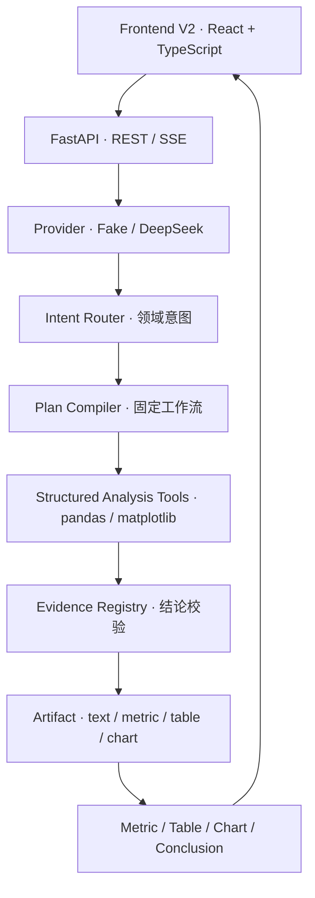

# 析数｜房地产销售经营分析工作台

**AI Data Analyst for Real Estate Sales Operations**

上传 CSV / Excel 销售数据，通过自然语言完成渠道、项目、置业顾问、销售漏斗、成交趋势等分析，并生成指标、表格、图表和可追溯的分析结论。

## 项目简介

「析数」是一个面向房地产销售经营数据的个人作品集项目。用户上传 CSV / XLSX 数据后，可以查看字段质量与数据预览，并通过自然语言发起受控分析。

核心思路是把「自然语言理解」和「确定性数据计算」分离：模型只负责识别高层分析意图（分析什么、按什么维度、看什么指标），而字段映射、聚合规则、图表规划、业务数字都由服务端的确定性流程完成，避免模型直接生成错误计算。

分析过程通过 Agent 化的结构化流水线执行，用 SSE 实时推送状态，最终沉淀为可追溯的 Metric / Table / Chart Artifact 和历史记录，刷新后可恢复。

## 核心能力

- 数据上传与质量概览：CSV / XLSX 上传、字段类型、缺失值、唯一值、数据预览
- 房地产销售经营语义理解：渠道、项目、置业顾问、户型、客户等级等维度意图识别
- 渠道 / 项目 / 置业顾问 / 户型分析：多维分组对比
- 销售漏斗分析：线索 → 到访 → 认购 → 签约 → 回款
- 成交金额与趋势分析：按自然月的分类趋势
- 高线索低成交转化识别：自动定位线索量大但转化率偏低的组合
- 推荐分析问题：基于数据字段生成可点选的推荐问题
- Metric / Table / Chart Artifact：结构化结果展示
- SSE 流式执行状态：实时进度与事件推送
- 历史分析恢复：Conversation / Run / Step / Artifact 持久化，刷新可恢复

## 房地产业务模型

### 销售漏斗

```text
线索 → 到访 → 认购 → 签约 → 回款
```

### 核心指标

| 类型 | 指标 |
|---|---|
| 计数 | 线索数、到访数、认购数、成交套数 |
| 金额 | 成交金额、回款金额 |
| 转化率 | 到访率、认购转化率、成交转化率 |
| 派生 | 平均成交金额 |

### 核心维度

项目、城市、区域、置业顾问、获客渠道、户型、客户等级。

## Demo 数据集

`demo/real_estate_sales_demo.csv` 是一份完全合成的演示数据，不包含任何真实房地产公司、楼盘、客户或个人信息。置业顾问使用匿名编号（顾问 01 ～ 12）。

- 520 条销售线索
- 14 个字段
- 18 个月（2025-01 ～ 2026-06）
- 4 个模拟项目
- 6 个获客渠道
- 12 名匿名置业顾问

经过实际计算验证的部分 Demo 结果（均为合成数据的分析结果，非真实经营数据）：

| 观察 | 结果 |
|---|---|
| 短视频平台 | 约 150 条线索，成交 8 套，成交转化率约 5.33% |
| 老带新 | 成交转化率约 40% |
| 滨江悦府 | Demo 中成交金额最高，合计 93,743,000 |

数据由 `demo/generate_real_estate_sales_demo.py` 使用固定随机种子生成，可重复重建。详见 [demo/README_REAL_ESTATE.md](demo/README_REAL_ESTATE.md)。

## 架构



## 受控分析流水线

这个项目不是简单的「LLM → pandas 代码」。一条分析问题会经过一条受控流水线：

```text
用户问题 → Intent → Plan → Tool execution → Evidence → Artifact → 确定性结论
```

- 模型只输出受限的领域意图（维度 + 指标 ID），不直接生成计算代码；
- Plan Compiler 把意图编译成固定的工具步骤，并做执行前校验；
- pandas 负责全部统计数字，matplotlib 负责图表；
- Evidence Registry 校验结论引用的每个业务数字，非法时安全降级。

为什么采用受控分析流水线：

- 降低模型直接生成错误计算的风险；
- 指标语义集中管理（领域注册表统一定义维度、指标和单位）；
- 结果可验证（每个数字都能追溯到具体工具输出）；
- Tool 输出可追踪（RunStep / Artifact 持久化）；
- 前端展示契约稳定（只渲染 text / metric / table / chart 四类 Artifact）。

## 技术栈

- **后端**：Python 3.10、FastAPI、SQLAlchemy 2、Alembic、Pydantic、SSE
- **分析计算**：pandas、NumPy
- **图表**：matplotlib、seaborn
- **模型**：DeepSeek（可选）、Fake deterministic provider（默认）
- **V1 兼容层**：LangChain、LangGraph
- **前端**：React 19、TypeScript 5.9、Vite 7、TanStack Query、Tailwind CSS 4
- **测试**：pytest、Vitest、React Testing Library、jsdom
- **存储**：SQLite、本地文件系统

## Provider 说明

- **Fake deterministic provider（默认）**：无需 API Key 和外部网络，输出确定性结果，用于稳定演示、自动化测试和确定性验收。
- **DeepSeek Provider**：项目保留接入；配置 API Key 后可用于真实自然语言意图识别与结构化结论生成。

> 说明：Demo 与自动化测试默认使用确定性 Provider，以保证结果稳定可复现。项目保留 DeepSeek Provider 接入，但真实 DeepSeek 端到端验收尚未在具备有效 API Key 的环境下完成最终 Smoke Test。

## 演示问题

以下问题适合用于演示：

1. 哪些获客渠道线索很多，但成交转化率偏低？
2. 哪个项目成交金额最高？
3. 最近几个月成交金额趋势如何？
4. 各置业顾问成交套数排名如何？
5. 不同客户等级的成交转化表现如何？

## 项目截图

<!-- TODO: 补充房地产销售经营分析 Demo 的最终界面截图，使用仓库内相对路径。 -->

## 快速开始

### 环境要求

- Python 3.10+
- Node.js 20+（推荐 22）
- npm 10+

### 1. 安装依赖

```bash
python -m pip install -r requirements.txt
cp .env.example .env

cd frontend-v2
npm ci
cd ..
```

`.env.example` 默认使用 Fake Provider：

```dotenv
V2_PROVIDER=fake
DATABASE_URL=sqlite:///./app.db
UPLOAD_DIR=./storage/uploads
CHART_DIR=./storage/charts
BACKEND_HOST=127.0.0.1
BACKEND_PORT=8000
FRONTEND_ORIGIN=http://localhost:5174
```

不要将真实 API Key 提交到 Git。

### 2. 启动后端

```bash
python -m app.migrate
python -m app.run
```

后端地址：`http://127.0.0.1:8000`。FastAPI 启动只检查 Alembic revision，不自动执行迁移。

### 3. 启动前端

另开一个终端：

```bash
cd frontend-v2
npm run dev
```

打开 `http://localhost:5174`。

### 4. 上传 Demo 数据

在界面中上传 `demo/real_estate_sales_demo.csv`，即可开始分析。

### Windows 一键演示

Windows 下可以在一个 PowerShell 窗口同时启动前后端：

```powershell
.\start-demo.ps1
```

脚本默认使用 Fake Provider，将运行数据写入仓库外的临时目录。只有显式传入 `-Provider DeepSeek` 且环境中存在有效 `DEEPSEEK_API_KEY` 时才会使用真实模型。结束后运行：

```powershell
.\stop-demo.ps1
```

## 测试

后端：

```bash
python -m pytest -q
```

前端：

```bash
cd frontend-v2
npm run typecheck
npm run lint
npm test
npm run build
```

自动测试使用临时数据库、匿名数据和 Fake/Mock Provider，不发起真实模型请求。

房地产版本收口时的验收基线：后端 350 tests passed，前端 82 tests passed（16 个测试文件）。这是本次 release checkpoint 的状态，测试数量会随后续修改变化。

## 项目结构

```text
app/
├── api/                 # V1 兼容接口
├── db/                  # V1 ORM 与数据库连接
├── services/            # V1 Agent、解析、画像与图表
└── v2/                  # V2 受控分析闭环
    ├── api/             # V2 REST / SSE
    ├── db/              # Run、Step、Artifact、Event
    ├── domain/          # 领域注册表、Intent 路由
    ├── schemas/         # API、Intent、Result、Artifact、Event
    └── services/        # 执行器、分析、图表、Evidence、Provider
frontend-v2/             # 当前 React 工作台
demo/                    # 合成演示数据与生成脚本
tests/                   # 后端与端到端测试
docs/                    # 架构、部署与 V2 说明
```

## 关键设计决策

### 领域契约集中管理

`RealEstateDomainRegistry` 统一定义维度、日期、指标和语义（含单位与派生关系），避免语义散落在多个模块。

### LLM 不直接控制物理字段

Intent 与 Plan 使用逻辑 ID（如 `lead_channel`、`deal_rate`），由 Plan Compiler 映射到实际数据字段，模型无法直接指定物理列名或聚合方式。

### 计算与语言生成分离

pandas 工具负责确定性计算，模型负责理解问题和生成结构化意图，二者通过严格的 Schema 与 Evidence 校验衔接。

### Artifact Contract

前端只渲染 `text`、`metric`、`table`、`chart` 四类 Artifact，前后端通过稳定契约解耦，后端可替换 Provider 而不影响展示。

### Fake Provider

默认使用确定性 Provider，用于稳定测试和 Demo，真实模型路径保持可替换，无需密钥即可验证完整产品链路。

## 当前限制

- 月度派生转化率暂不支持（如按月计算成交转化率）。
- Demo 数据为合成模拟数据，不代表任何真实房地产公司业务数据。
- 图表当前主要为服务端生成的静态 PNG，不支持交互式编辑。
- Fake Provider 下自由文本理解能力有限，复杂自然语言分析依赖真实 LLM Provider。
- 合作式取消无法强制中断已进入执行的同步 pandas/matplotlib 计算。

## 进一步阅读

- [发布架构](docs/release/ARCHITECTURE.md)
- [部署与数据库迁移](docs/release/DEPLOYMENT.md)
- [房地产 Demo 数据说明](demo/README_REAL_ESTATE.md)
- [最小 V2 后端说明](docs/v2/MINIMAL_V2_BACKEND.md)
