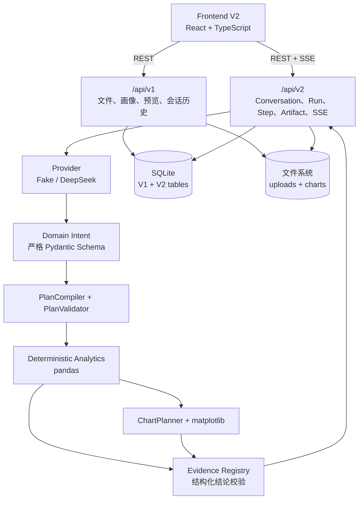
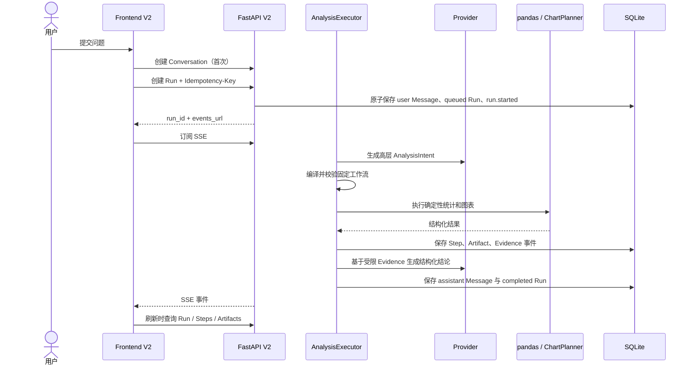
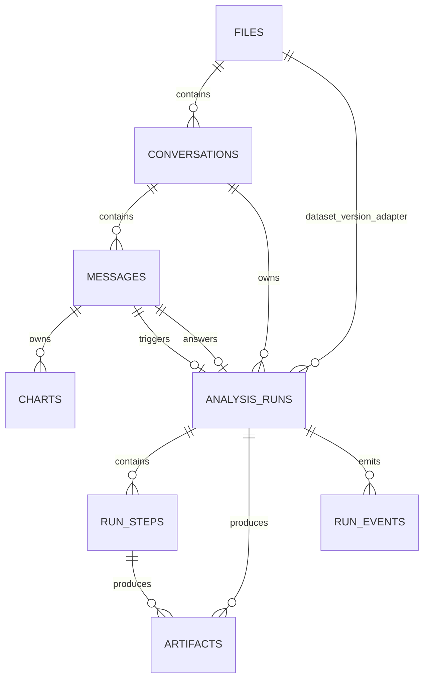

# 发布架构

## 设计目标

本项目将“模型理解”与“数据计算”分离。模型只能输出受限的高层意图；
服务端负责字段解析、工作流编译、参数校验、pandas 计算、图表规划和证据
校验。这样可以降低模型编造数字、调用任意工具或跨 Run 混用证据的风险。

## 系统组件

## 分析运行时序

## 数据模型

V2 过渡期继续使用 V1 `files`、`conversations` 和 `messages`。新的
`analysis_runs`、`run_steps`、`artifacts` 和 `run_events` 通过外键与
它们关联。正式 Dataset / DatasetVersion 仍属于后续架构演进，不在当前
发布范围。

## 状态与恢复

- Run：`queued → running → completed | failed | cancelled`
- Step：`pending → running → completed | failed | cancelled`
- SSE 提供实时体验，但不是唯一事实来源。
- 单个 Run 的 `sequence` 严格递增，`event_id` 用于去重。
- 页面刷新或 SSE 中断后，通过 REST 查询持久化状态。
- 终态不可回退；取消是合作式、幂等的。

## 安全边界

- 浏览器不接收服务器物理路径。
- table Artifact 只返回受限行数，不推送完整原始数据集。
- Markdown 不渲染原始 HTML。
- Prompt、API Key、完整模型响应和 Evidence Registry 不写入日志。
- DeepSeek 不能输出底层工具、字段来源、聚合规则、Python 或 SQL。
- Fake Provider 是默认发布验证路径，不访问外部模型。
