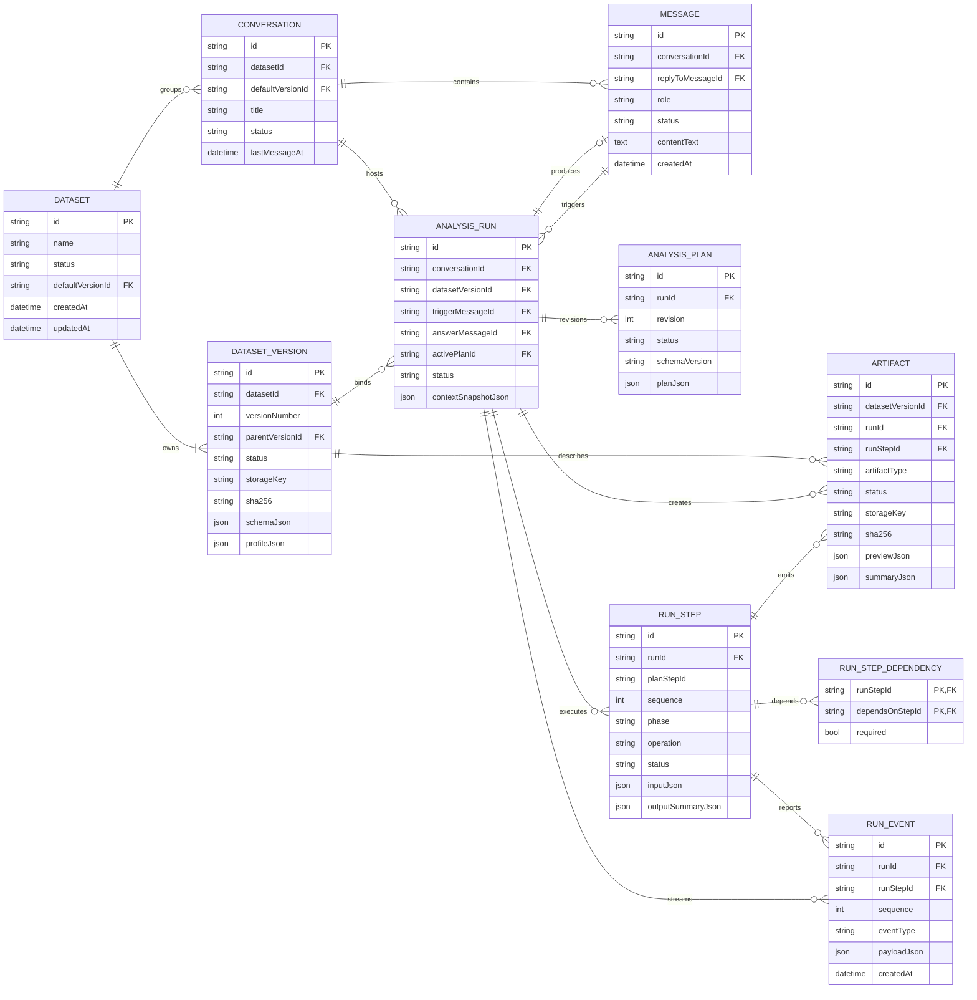

# V2 逻辑数据模型

> 合同状态：V2 设计合同，当前尚未实现。当前可运行系统仍使用 `/api/v1` 和 V1 四表。本文不是 SQLAlchemy 实现或迁移脚本；实现阶段以 Pydantic Schema、生成的 OpenAPI 和正式数据库迁移为最终事实来源。

## 1. 范围

本文定义逻辑表、字段、约束和索引，不是 SQLAlchemy 实现或 Alembic migration。字段类型使用跨数据库表达；V2 第一版可落到 SQLite，但设计不依赖 SQLite 特性。

约定：

- 主键：`string`，服务端生成的 UUIDv7/ULID 风格不透明 ID。
- 时间：`datetime`，UTC、带时区语义。
- JSON：数据库 JSON 类型或序列化 text，由 Pydantic model 校验。
- 所有表至少有 `created_at`；可变表有 `updated_at`。
- 枚举在应用模型和数据库 CHECK constraint 中保持同一来源。
- 外键默认 `RESTRICT`；只对纯附属支持表使用 `CASCADE`。

## 2. 实体关系图

ERD 省略了迁移专用表和部分审计字段。`ANALYSIS_RUN.active_plan_id` 与 `ANALYSIS_PLAN.run_id` 形成受控循环：先创建 Run，再创建 Plan，校验通过后设置 active plan。

## 3. 表定义

### 3.1 datasets

| 字段 | 类型 | Null | 约束/说明 |
|---|---|---:|---|
| `id` | string | 否 | PK |
| `name` | string(200) | 否 | 用户可见名称 |
| `description` | text | 是 | 用户可见说明 |
| `status` | enum | 否 | active/archived/pending_delete |
| `default_version_id` | string | 是 | FK dataset_versions.id；必须属于自身 |
| `metadata_json` | json | 否 | 默认 `{}`，禁止存执行状态 |
| `created_at` | datetime | 否 | UTC |
| `updated_at` | datetime | 否 | UTC |
| `archived_at` | datetime | 是 | 状态进入 archived 时填写 |
| `deleted_at` | datetime | 是 | pending_delete 后填写 |

索引与约束：

- index `(status, updated_at desc)`。
- 应用级约束：`default_version_id.dataset_id = datasets.id`。
- Dataset 归档后禁止新建 Conversation 和 DatasetVersion，除非先恢复 active。

### 3.2 dataset_versions

| 字段 | 类型 | Null | 约束/说明 |
|---|---|---:|---|
| `id` | string | 否 | PK |
| `dataset_id` | string | 否 | FK datasets.id, RESTRICT |
| `version_number` | int | 否 | 从 1 递增 |
| `parent_version_id` | string | 是 | FK dataset_versions.id；同 Dataset |
| `source_type` | enum | 否 | upload/cleaned/migrated |
| `status` | enum | 否 | ingesting/profiling/ready/failed/archived |
| `original_filename` | string(512) | 是 | 只作展示，不能作为 storage path |
| `media_type` | string(100) | 否 | `text/csv`、XLSX MIME 等 |
| `storage_backend` | enum | 否 | local/object_store |
| `storage_key` | string(1024) | 否 | 内部字段，不能直接返回前端 |
| `sha256` | string(64) | 否 | 内容 hash |
| `size_bytes` | bigint | 否 | >= 0 |
| `row_count` | bigint | 是 | ready 时必填 |
| `column_count` | int | 是 | ready 时必填 |
| `schema_json` | json | 是 | 结构化字段定义 |
| `profile_json` | json | 是 | 结构化画像，不是 Markdown |
| `transform_recipe_json` | json | 是 | cleaned 版本必填 |
| `created_by_run_id` | string | 是 | FK analysis_runs.id；cleaned 可填写 |
| `error_json` | json | 是 | failed 时脱敏错误 |
| `created_at` | datetime | 否 | UTC |
| `updated_at` | datetime | 否 | 仅 ingest 生命周期 |
| `ready_at` | datetime | 是 | ready 时填写 |
| `archived_at` | datetime | 是 | archived 时填写 |

索引与约束：

- unique `(dataset_id, version_number)`。
- index `(dataset_id, status, version_number desc)`。
- index `(sha256)`，仅用于查重提示，不默认跨 Dataset 合并。
- CHECK：ready 时 `row_count`、`column_count`、`schema_json`、`profile_json` 非空。
- CHECK：source_type=cleaned 时 parent_version_id 和 transform_recipe_json 非空。

### 3.3 conversations

| 字段 | 类型 | Null | 约束/说明 |
|---|---|---:|---|
| `id` | string | 否 | PK |
| `dataset_id` | string | 否 | FK datasets.id, RESTRICT |
| `default_version_id` | string | 是 | FK dataset_versions.id；必须属于 dataset_id |
| `title` | string(300) | 否 | 默认由首条分析请求生成，可编辑 |
| `status` | enum | 否 | active/archived |
| `metadata_json` | json | 否 | 默认 `{}` |
| `last_message_at` | datetime | 是 | 列表排序缓存字段 |
| `created_at` | datetime | 否 | UTC |
| `updated_at` | datetime | 否 | UTC |
| `archived_at` | datetime | 是 | UTC |

索引：`(dataset_id, status, last_message_at desc)`。

### 3.4 messages

| 字段 | 类型 | Null | 约束/说明 |
|---|---|---:|---|
| `id` | string | 否 | PK |
| `conversation_id` | string | 否 | FK conversations.id, RESTRICT |
| `reply_to_message_id` | string | 是 | FK messages.id；同一 Conversation |
| `role` | enum | 否 | user/assistant/system；system 不用于工具日志 |
| `content_format` | enum | 否 | plain_text/markdown |
| `content_text` | text | 否 | committed 后不可改 |
| `status` | enum | 否 | draft/committed/superseded/hidden |
| `metadata_json` | json | 否 | 迁移信息、引用 artifact_ids、展示 metadata |
| `created_at` | datetime | 否 | UTC |
| `updated_at` | datetime | 否 | draft/状态变化时更新 |

索引：

- `(conversation_id, created_at, id)`，稳定游标分页。
- `(reply_to_message_id)`。

### 3.5 analysis_runs

| 字段 | 类型 | Null | 约束/说明 |
|---|---|---:|---|
| `id` | string | 否 | PK |
| `conversation_id` | string | 否 | FK conversations.id, RESTRICT |
| `dataset_version_id` | string | 否 | FK dataset_versions.id, RESTRICT；创建后不可改 |
| `trigger_message_id` | string | 否 | FK messages.id；role=user |
| `answer_message_id` | string | 是 | FK messages.id；role=assistant；完成前可空 |
| `parent_run_id` | string | 是 | FK analysis_runs.id；追问引用 |
| `retry_of_run_id` | string | 是 | FK analysis_runs.id；显式重跑引用 |
| `active_plan_id` | string | 是 | FK analysis_plans.id；valid plan |
| `status` | enum | 否 | queued/running/completed/failed/cancelled |
| `current_phase` | enum | 是 | plan_generation/plan_validation/execution/result_validation/answer_generation；queued/terminal 时可空 |
| `context_snapshot_json` | json | 否 | 选中的消息/run/artifact ID 与策略版本 |
| `progress_json` | json | 否 | 可重建的进度缓存，不是步骤事实来源 |
| `failure_json` | json | 是 | code/type/message/retryable/failed_step_id |
| `requested_by` | string | 是 | 用户/系统身份 |
| `idempotency_key` | string(128) | 否 | Conversation 范围唯一 |
| `model_config_json` | json | 否 | provider/model/prompt/schema 版本，不含 secret |
| `created_at` | datetime | 否 | UTC |
| `updated_at` | datetime | 否 | 状态更新 |
| `started_at` | datetime | 是 | 第一次进入 running |
| `completed_at` | datetime | 是 | terminal 时填写 |
| `heartbeat_at` | datetime | 是 | active worker 心跳 |
| `cancelled_at` | datetime | 是 | cancelled 时填写 |

索引与约束：

- unique `(conversation_id, idempotency_key)`。
- index `(conversation_id, created_at desc)`。
- index `(dataset_version_id, status)`。
- index `(status, heartbeat_at)`，恢复器扫描。
- 应用级约束：Conversation.dataset_id 必须等于 DatasetVersion.dataset_id。
- completed 时 answer_message_id、completed_at 非空且必须存在 completed result_validation Step。

### 3.6 analysis_plans

| 字段 | 类型 | Null | 约束/说明 |
|---|---|---:|---|
| `id` | string | 否 | PK |
| `run_id` | string | 否 | FK analysis_runs.id, RESTRICT |
| `revision` | int | 否 | 从 1 递增 |
| `schema_version` | string(30) | 否 | 例如 `1.0` |
| `status` | enum | 否 | draft/validating/valid/invalid/superseded |
| `goal` | text | 否 | 用户目标规范化描述 |
| `dataset_version_id` | string | 否 | 服务端绑定；必须等于 Run |
| `plan_json` | json | 否 | 通过 AnalysisPlan Pydantic schema 解析 |
| `validation_errors_json` | json | 否 | 默认 `[]` |
| `warnings_json` | json | 否 | 默认 `[]` |
| `created_by` | enum | 否 | model/system/migration |
| `model_trace_json` | json | 是 | 模型和 Prompt 版本、token 统计；不含 secret |
| `created_at` | datetime | 否 | UTC |
| `updated_at` | datetime | 否 | draft 生命周期 |
| `validated_at` | datetime | 是 | valid/invalid 时填写 |

约束：unique `(run_id, revision)`；每个 Run 最多一个 `status=valid` 且为 active 的计划，旧 valid 计划在新修订启用时变 superseded。

### 3.7 run_steps

| 字段 | 类型 | Null | 约束/说明 |
|---|---|---:|---|
| `id` | string | 否 | PK |
| `run_id` | string | 否 | FK analysis_runs.id, RESTRICT |
| `plan_step_id` | string(100) | 是 | 系统步骤可空；计划步骤必须对应 active plan |
| `sequence` | int | 否 | 稳定展示顺序 |
| `phase` | enum | 否 | plan_generation/plan_validation/execution/result_validation/answer_generation |
| `operation` | string(100) | 否 | 协议 operation 名称 |
| `status` | enum | 否 | pending/running/completed/failed/cancelled |
| `input_json` | json | 否 | 严格 schema 校验后的输入；含 server binding snapshot |
| `output_summary_json` | json | 是 | 模型可见有限摘要 |
| `attempt_count` | int | 否 | 默认 0 |
| `max_attempts` | int | 否 | 默认 1，受 operation policy 限制 |
| `idempotency_key` | string(160) | 否 | Run 内唯一 |
| `error_json` | json | 是 | 统一错误结构 |
| `lease_expires_at` | datetime | 是 | running 时使用 |
| `worker_id` | string | 是 | 内部字段 |
| `created_at` | datetime | 否 | UTC |
| `updated_at` | datetime | 否 | UTC |
| `started_at` | datetime | 是 | UTC |
| `finished_at` | datetime | 是 | terminal step 时填写 |
| `last_heartbeat_at` | datetime | 是 | UTC |

约束和索引：

- unique `(run_id, idempotency_key)`。
- unique `(run_id, sequence)`。
- index `(run_id, status, sequence)`。
- running 时 lease、started_at、worker_id 非空。
- completed 时 output_summary_json 和 finished_at 非空。

### 3.8 run_step_dependencies

| 字段 | 类型 | Null | 约束/说明 |
|---|---|---:|---|
| `run_step_id` | string | 否 | PK, FK run_steps.id, CASCADE |
| `depends_on_step_id` | string | 否 | PK, FK run_steps.id, CASCADE |
| `required` | bool | 否 | 默认 true |
| `created_at` | datetime | 否 | UTC |

约束：不能依赖自身；两端必须属于同一 Run；写入前做 DAG 循环检测。

### 3.9 artifacts

| 字段 | 类型 | Null | 约束/说明 |
|---|---|---:|---|
| `id` | string | 否 | PK |
| `dataset_version_id` | string | 否 | FK dataset_versions.id, RESTRICT |
| `run_id` | string | 是 | FK analysis_runs.id, RESTRICT；数据集级/迁移 Artifact 可空 |
| `run_step_id` | string | 是 | FK run_steps.id, RESTRICT；存在时 run_id 必填且一致 |
| `source_artifact_id` | string | 是 | FK artifacts.id，派生来源 |
| `artifact_type` | enum | 否 | 第一阶段：text/metric/table/chart；扩展：report/dataset_preview/cleaned_dataset/error_log |
| `status` | enum | 否 | creating/ready/failed/quarantined/pending_delete/deleted |
| `title` | string(300) | 否 | 前端展示 |
| `content_format` | string(100) | 是 | json/parquet/csv/png/svg/markdown/pdf 等 |
| `storage_backend` | enum | 是 | inline/local/object_store |
| `storage_key` | string(1024) | 是 | ready 非 inline 时必填 |
| `inline_content_json` | json | 是 | 仅限大小阈值内的 text/metric/spec metadata |
| `sha256` | string(64) | 是 | ready 时必填 |
| `size_bytes` | bigint | 是 | ready 时必填 |
| `row_count` | bigint | 是 | table/dataset 类型使用 |
| `schema_json` | json | 是 | 表格或图表数据 schema |
| `summary_json` | json | 否 | 默认 `{}` |
| `preview_json` | json | 是 | 有限预览和 sampling metadata |
| `config_json` | json | 是 | 图表规范、报告格式等 |
| `metadata_json` | json | 否 | 敏感性、迁移、展示 metadata |
| `created_at` | datetime | 否 | UTC |
| `updated_at` | datetime | 否 | 生命周期变化 |
| `ready_at` | datetime | 是 | ready 时填写 |
| `deleted_at` | datetime | 是 | deleted 时填写 |

索引：

- `(run_id, artifact_type, created_at)`。
- `(run_step_id, created_at)`。
- `(dataset_version_id, status)`。
- `(sha256)`。

CHECK：ready 时必须存在 `sha256`、`size_bytes`，且 `inline_content_json` 与 `storage_key` 至少一个存在。

### 3.10 run_events

该表是 SSE 可重放事件日志，不等于通用系统日志。

| 字段 | 类型 | Null | 约束/说明 |
|---|---|---:|---|
| `id` | string | 否 | PK，对应 event_id |
| `run_id` | string | 否 | FK analysis_runs.id, CASCADE |
| `run_step_id` | string | 是 | FK run_steps.id, SET NULL |
| `sequence` | bigint | 否 | Run 内严格递增 |
| `event_type` | enum | 否 | SSE_PROTOCOL 定义 |
| `schema_version` | string(20) | 否 | 默认 `1.0` |
| `payload_json` | json | 否 | 严格事件 payload |
| `created_at` | datetime | 否 | 事件 timestamp |

约束和索引：

- unique `(run_id, sequence)`。
- unique `(id)`。
- index `(run_id, created_at)`。
- 状态变化和对应 durable event 必须在同一事务中提交，防止 REST 与 SSE 事实分叉。

`step_progress` 可按节流策略合并，其他状态事件必须持久化。

## 4. JSON 字段版本化

所有可长期读取的 JSON 至少包含 `schema_version` 或由所在记录提供版本：

- `schema_json`：数据字段 schema 版本。
- `profile_json`：画像 schema 版本。
- `plan_json`：AnalysisPlan schema 版本。
- `context_snapshot_json`：Context Builder policy 版本。
- `error_json`：ErrorEnvelope 版本。
- `config_json`：Artifact 类型专属 schema 版本。

读取端必须支持当前版本和明确的迁移适配，不允许默默忽略未知必填字段。

## 5. 事务边界

| 操作 | 必须原子提交的记录 |
|---|---|
| 创建数据集 | Dataset + ingesting DatasetVersion |
| 提交分析问题 | committed user Message + queued AnalysisRun + `run.started` event |
| 启用计划 | valid AnalysisPlan + AnalysisRun.active_plan_id + RunStep DAG + `run.status` event |
| 完成步骤 | RunStep status/output + Artifact metadata + `step.completed`/`artifact.created` events |
| 完成运行 | completed result validation Step + assistant Message + AnalysisRun completed + `answer.completed`/`run.completed` events |
| 失败运行 | failed Step（如有）+ AnalysisRun failure/status + `run.failed` event |

物理文件写入不能完全参与数据库事务。推荐顺序：写临时对象 → 计算 hash → 数据库创建 creating Artifact → 原子移动/完成上传 → 数据库标记 ready；失败时记录 failed 并由清理器删除临时对象。

## 6. 迁移支持表

V1→V2 迁移工具可在 V2 数据库中创建以下支持表，不属于运行时核心 API：

### legacy_id_map

- `source_table`、`source_id`、`target_type`、`target_id`、`source_hash`、`migrated_at`。
- unique `(source_table, source_id, target_type)`。
- 用于幂等重跑迁移和审计。

### migration_quarantine_records

- `id`、`source_table`、`source_id`、`reason_code`、`source_payload_json`、`storage_path`、`detected_at`、`review_status`。
- 不建立到正常 Dataset/Artifact 的猜测性 FK。
- 默认不通过产品 API 暴露。

## 7. 数据库实现建议

- V2 从第一条 schema 变更开始使用 Alembic，禁止以 `create_all` 代替迁移历史。
- SQLite 开发环境必须对每个连接启用 foreign_keys；测试加入 `foreign_key_check`。
- JSON schema 和跨表归属约束由应用服务验证，关键枚举/非空/唯一约束仍落数据库。
- 不对 Dataset、Run、Artifact 使用数据库级全量级联删除；删除由领域服务编排并可审计。
