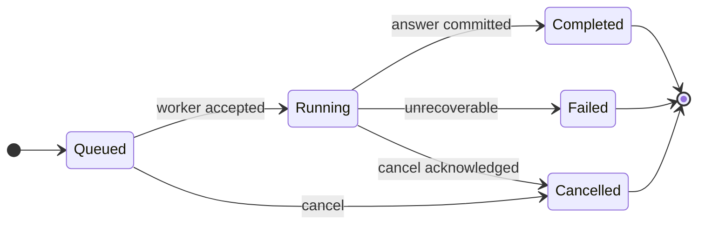

# V2 核心领域模型

> 合同状态：V2 设计合同，当前尚未实现。当前可运行系统仍使用 `/api/v1`。本文描述目标边界，不代表对应路由、数据库表或运行时代码已经存在；实现阶段以 Pydantic Schema、生成的 OpenAPI 和正式数据库迁移为最终事实来源。

> V2 第一版范围：单用户、本地运行的作品集项目；不实现登录、权限、组织或多租户。对话输入继续保留，但结果画布是产品中心，Agent 执行详情放入按需打开的抽屉。

## 1. 设计目标与约束

V2 的核心目标不是让 LLM 获得更多自由，而是让每一次分析都能回答以下问题：

- 使用了哪个数据集的哪个不可变版本；
- 用户问题、分析计划、执行步骤和最终答案如何关联；
- 每个结论由哪些结构化结果或 Artifact 支撑；
- 中断、失败、重试和恢复发生在什么位置；
- 前端刷新后如何从服务端恢复真实状态。

统一约束：

- 所有时间使用 UTC、带时区的 ISO-8601；数据库保存 UTC。
- 所有 ID 是服务端生成的不可猜测不透明 ID。API 示例使用 `dset_`、`dver_`、`run_` 等前缀表达类型，具体实现可使用 UUIDv7 或 ULID。
- `DatasetVersion`、`AnalysisPlan` 已验证版本、已开始的 `AnalysisRun`、已完成的 `RunStep` 和 ready Artifact 内容均不可原地修改。
- 所有服务端绑定字段都不能接受模型提供的值作为事实来源。
- 删除优先使用软删除或归档；物理文件由引用检查后的垃圾回收任务处理。
- V2 第一阶段固定为单用户本地项目，不在核心表预留 `owner_id`、`scope_id`、组织或租户字段；未来如转为多用户产品，应通过独立版本化设计和迁移引入。

## 2. 聚合边界

| 聚合 | 聚合根 | 包含或控制 | 一致性边界 |
|---|---|---|---|
| 数据集 | Dataset | DatasetVersion、数据集级 Artifact | 创建版本、版本号递增、归档与引用保护 |
| 对话 | Conversation | Message | 消息顺序、数据集归属、对话归档 |
| 分析运行 | AnalysisRun | AnalysisPlan、RunStep、运行级 Artifact、运行事件 | 状态机、计划修订、步骤依赖、最终答案和证据 |
| Artifact | Artifact | 结构化元数据与外部存储对象 | 内容哈希、ready 状态、预览与下载、删除回收 |

跨聚合操作由应用服务协调，不在路由或 LLM 工具中直接跨表写入。

## 3. 核心实体

### 3.1 Dataset

| 项目 | 设计 |
|---|---|
| 业务职责 | 表示用户认知中的一个稳定数据集，例如“月度销售数据”。版本变化不改变 Dataset 身份。 |
| 主键 | `dataset_id` |
| 主要字段 | `name`、`description`、`status`、`default_version_id`、`metadata_json` |
| 状态 | `active`、`archived`、`pending_delete` |
| 时间 | `created_at`、`updated_at`、`archived_at`、`deleted_at` |
| 关系 | 1:N DatasetVersion；1:N Conversation；1:N Artifact（仅数据集级或迁移级） |
| 删除策略 | 默认软删除。存在非终态 AnalysisRun 时拒绝删除；版本和 Artifact 先标记归档，物理对象延迟回收。 |
| 可修改性 | `name`、`description`、非执行性 metadata 可修改；ID、owner 和历史版本关系不可改。 |
| 前端展示 | 名称、描述、状态、默认版本摘要、更新时间、版本数。 |
| 内部字段 | owner/scope、删除标记、审计 metadata、默认版本 FK。 |

`default_version_id` 只用于新对话或新运行的默认选择，不改变历史运行绑定的版本。

### 3.2 DatasetVersion

| 项目 | 设计 |
|---|---|
| 业务职责 | 表示一次不可变的数据快照及其结构化画像。原始上传是第一个版本，清洗结果创建新版本。 |
| 主键 | `dataset_version_id` |
| 主要字段 | `dataset_id`、`version_number`、`parent_version_id`、`source_type`、`status`、`original_filename`、`media_type`、`storage_key`、`sha256`、`size_bytes`、`row_count`、`column_count`、`schema_json`、`profile_json`、`transform_recipe_json`、`created_by_run_id` |
| 状态 | `ingesting`、`profiling`、`ready`、`failed`、`archived` |
| 时间 | `created_at`、`updated_at`、`ready_at`、`archived_at` |
| 关系 | N:1 Dataset；可选 N:1 parent DatasetVersion；1:N AnalysisRun；1:N Artifact。 |
| 删除策略 | ready 且被 Run/Artifact 引用时不能物理删除。Dataset 删除时先归档，再等待所有引用进入可回收状态。 |
| 可修改性 | ingesting/profiling 时可补齐受控字段；进入 ready 后内容、hash、schema、profile 不可变。失败版本仅可补错误详情或归档。 |
| 前端展示 | 版本号、来源、文件名、状态、行列数、schema/profile 摘要、创建时间。 |
| 内部字段 | storage key、hash、transform recipe、父版本、错误详情、created_by_run_id。 |

版本规则：

1. 上传文件成功创建 Dataset 后，同时创建 `version_number=1` 的原始版本。
2. 上传内容本身不可覆盖；相同 hash 是否复用由产品策略决定，但必须保留一次上传审计记录。
3. 清洗操作生成新的物理数据对象、新 DatasetVersion 和完整 transform recipe；不能修改父版本。
4. AnalysisRun 创建时复制并固定 `dataset_version_id`。Dataset 默认版本后续变化不影响已创建运行。

### 3.3 Conversation

| 项目 | 设计 |
|---|---|
| 业务职责 | 组织围绕同一 Dataset 的用户消息、助手回答和运行引用。它是交互容器，不是分析证据本身。 |
| 主键 | `conversation_id` |
| 主要字段 | `dataset_id`、`title`、`status`、`default_version_id`、`last_message_at`、`metadata_json` |
| 状态 | `active`、`archived` |
| 时间 | `created_at`、`updated_at`、`archived_at` |
| 关系 | N:1 Dataset；1:N Message；1:N AnalysisRun。 |
| 删除策略 | 默认归档。硬删除需先满足运行和 Artifact 保留策略，且不能破坏审计证据。 |
| 可修改性 | 标题、归档状态、默认版本可修改；Dataset 归属不可改。 |
| 前端展示 | 标题、状态、最近消息、最近运行状态、消息数、更新时间。 |
| 内部字段 | context policy 默认值、迁移 metadata、默认版本 FK。 |

Conversation 绑定 Dataset 而非固定版本；每个 AnalysisRun 必须显式固定具体版本。

### 3.4 Message

| 项目 | 设计 |
|---|---|
| 业务职责 | 保存用户与助手可见的对话内容。工具输入输出和执行日志不伪装成 Message。 |
| 主键 | `message_id` |
| 主要字段 | `conversation_id`、`role`、`content_format`、`content_text`、`reply_to_message_id`、`status`、`metadata_json` |
| 状态 | `draft`、`committed`、`superseded`、`hidden` |
| 时间 | `created_at`、`updated_at` |
| 关系 | N:1 Conversation；可选自引用 reply；一个用户 Message 可触发 0:N AnalysisRun；一个 AnalysisRun 最多生成一个最终助手 Message。 |
| 删除策略 | 已触发运行或作为上下文快照的消息不可硬删除；可 hidden。草稿可删除。 |
| 可修改性 | draft 可编辑；committed 后正文不可原地修改，纠正通过新消息或 superseded 关系表达。 |
| 前端展示 | role、正文、格式、创建时间、关联运行摘要、引用关系。 |
| 内部字段 | 迁移 metadata、内容安全标签、context inclusion metadata。 |

并非每条用户消息都必须创建 AnalysisRun：

- 数据分析请求：创建 Message 和 AnalysisRun，二者在同一事务中提交。
- 纯界面命令、取消操作：调用相应命令 API，不创建分析运行。
- 需要澄清的问题：可先保存 Message，等用户补充后再创建 Run。
- 显式“重新运行”：允许同一 trigger Message 关联多个 Run，但新 Run 必须填写 `retry_of_run_id` 或 `parent_run_id`，前端标出哪次为当前结果。

### 3.5 AnalysisRun

| 项目 | 设计 |
|---|---|
| 业务职责 | 一次分析请求的事实容器，固定数据版本，贯穿规划、校验、执行、结果校验和回答生成。 |
| 主键 | `run_id` |
| 主要字段 | `conversation_id`、`dataset_version_id`、`trigger_message_id`、`answer_message_id`、`parent_run_id`、`retry_of_run_id`、`active_plan_id`、`status`、`context_snapshot_json`、`failure_json`、`requested_by`、`idempotency_key` |
| 状态 | 见 4.1 状态机。 |
| 时间 | `created_at`、`updated_at`、`started_at`、`completed_at`、`heartbeat_at`、`cancelled_at` |
| 关系 | N:1 Conversation、DatasetVersion、trigger Message；可选 answer Message；1:N AnalysisPlan、RunStep、Artifact、RunEvent；可选父 Run/重试 Run。 |
| 删除策略 | 不硬删除。Conversation/Dataset 归档时运行保持只读；按保留策略可脱敏内容但保留状态和校验摘要。 |
| 可修改性 | 状态、心跳、active_plan、answer_message 和失败信息按状态机更新；绑定版本、触发消息和已存在步骤不可改。 |
| 前端展示 | 状态、目标摘要、版本、当前阶段、进度、开始/结束时间、失败摘要、最终答案和 Artifact 摘要。 |
| 内部字段 | context snapshot、lease/worker、幂等键、详细 failure、模型/Prompt 版本、成本与耗时。 |

### 3.6 RunStep

| 项目 | 设计 |
|---|---|
| 业务职责 | 表示运行中的一个可审计逻辑步骤，包括系统阶段步骤和计划中的确定性操作。 |
| 主键 | `run_step_id` |
| 主要字段 | `run_id`、`plan_step_id`、`phase`、`operation`、`sequence`、`status`、`input_json`、`output_summary_json`、`attempt_count`、`max_attempts`、`idempotency_key`、`error_json`、`lease_expires_at` |
| 状态 | `pending`、`running`、`completed`、`failed`、`cancelled` |
| 时间 | `created_at`、`updated_at`、`started_at`、`finished_at`、`last_heartbeat_at` |
| 关系 | N:1 AnalysisRun；N:M 自身依赖；1:N Artifact。 |
| 删除策略 | 不硬删除；与 Run 一起只读保留。 |
| 可修改性 | 仅状态机、attempt、lease、输出摘要和错误可更新；成功后输入、operation 和结果摘要不可改。 |
| 前端展示 | phase、operation、状态、进度摘要、耗时、可重试性、产生的 Artifact。 |
| 内部字段 | 完整输入、幂等键、lease、错误详情、worker 信息和 attempt history。 |

`phase` 推荐值：`plan_generation`、`plan_validation`、`execution`、`result_validation`、`answer_generation`。

单步重试规则：

- 只有错误标记 `retryable=true`、未超过 `max_attempts`、且操作被声明为幂等或具有幂等键时允许自动重试。
- 每次重试递增 attempt，保留先前错误摘要；大型错误日志写入 `error_log` Artifact。
- schema/字段/计划校验错误不可原样重试，应回到计划修订或以 Run failed 结束。
- 已完成步骤不重复执行；依赖满足的 pending 步骤可进入 running。进程中断但执行结果无法确认时，该 Step 和 Run 进入 failed，并通过结构化 failure code 标记为可重试或需人工重跑。

### 3.7 Artifact

| 项目 | 设计 |
|---|---|
| 业务职责 | 统一表示可追溯分析产物。第一阶段核心类型为 `text`、`metric`、`table`、`chart`；`report`、`dataset_preview`、`cleaned_dataset`、`error_log` 属于后续扩展。 |
| 主键 | `artifact_id` |
| 主要字段 | `dataset_version_id`、`run_id`、`run_step_id`、`artifact_type`、`status`、`title`、`content_format`、`storage_backend`、`storage_key`、`sha256`、`size_bytes`、`row_count`、`schema_json`、`summary_json`、`preview_json`、`config_json`、`source_artifact_id`、`metadata_json` |
| 状态 | `creating`、`ready`、`failed`、`quarantined`、`pending_delete`、`deleted` |
| 时间 | `created_at`、`updated_at`、`ready_at`、`deleted_at` |
| 关系 | N:1 DatasetVersion；可选 N:1 AnalysisRun/RunStep；可选来源 Artifact。 |
| 删除策略 | 先 pending_delete；无消息、报告、Run 或版本引用后删除物理对象，最后标记 deleted。审计 metadata 可继续保留。 |
| 可修改性 | creating 时可写；ready 后内容、hash、schema 不可变，只允许标题、展示 metadata 和删除状态变化。 |
| 前端展示 | 类型、标题、状态、摘要、预览、行数、大小、创建时间、预览/下载 URL。 |
| 内部字段 | storage key、hash、完整 schema/config、来源、敏感性标签、迁移 metadata。 |

Artifact 内容策略：

- `metric`：少量结构化 JSON 可保存在数据库中，同时记录口径和单位。
- `table`：完整结果写 Parquet/CSV 或对象存储；数据库只保存 schema、row_count、summary 和有限 preview。
- `chart`：结构化图表规范是 V2 目标主记录；可选保存 PNG/SVG 预览或导出文件。V1 兼容导入允许只有静态 PNG，但必须通过受控 URL 暴露并标记为 legacy，不能只保存或返回服务器物理路径。
- `text`：正文较小时可内联并声明 plain text/Markdown 格式；`report` 是后续扩展类型，正式导出文件作为 storage object。
- `dataset_preview`：只包含有限行并标记抽样方法，不代表完整数据。
- `cleaned_dataset`：Artifact 表示清洗输出文件；验证成功后由应用服务创建新的 DatasetVersion 指向该不可变对象。
- `error_log`：只允许内部访问，前端仅展示脱敏错误摘要。

模型和普通 API 不直接接收大结果。默认仅返回 summary、最多 20 行 preview、truncated 和 artifact_id；完整内容通过 Artifact API 分页预览或下载。

### 3.8 AnalysisPlan

| 项目 | 设计 |
|---|---|
| 业务职责 | 保存某次 Run 的结构化、可版本化计划。模型产生 draft，服务端绑定版本并校验后才可执行。 |
| 主键 | `analysis_plan_id` |
| 主要字段 | `run_id`、`revision`、`schema_version`、`status`、`goal`、`dataset_version_id`、`plan_json`、`validation_errors_json`、`warnings_json`、`created_by` |
| 状态 | `draft`、`validating`、`valid`、`invalid`、`superseded` |
| 时间 | `created_at`、`updated_at`、`validated_at` |
| 关系 | N:1 AnalysisRun；valid plan 可生成 1:N RunStep。 |
| 删除策略 | 不硬删除；修订创建新记录，旧计划标记 superseded。 |
| 可修改性 | draft 可补全；进入 valid/invalid 后不可改。 |
| 前端展示 | goal、步骤摘要、假设、警告、校验状态、revision。 |
| 内部字段 | 完整 plan JSON、校验错误、模型/Prompt 版本、服务端绑定字段。 |

## 4. 生命周期与关键规则

### 4.1 AnalysisRun 状态机



数据库状态值统一为：`queued`、`running`、`completed`、`failed`、`cancelled`。规划、计划校验、结果校验和回答生成不是额外 Run 状态，而由 `current_phase`、RunStep 和 `run.status` 事件表达。不得使用 `success`、`done` 或 `finished` 表示 Run 完成。

`failed` 是该 Run 的终态。用户要求“重试整个分析”时创建新 Run，并通过 `retry_of_run_id` 关联；不要把 failed Run 原地改回 running。

### 4.2 计划阶段如何记录

| 阶段 | AnalysisRun 状态 | RunStep phase | 持久化结果 |
|---|---|---|---|
| 排队等待 | `queued` | 尚未创建或 `pending` | 请求、绑定版本、幂等键 |
| 计划生成 | `running` | `plan_generation` | draft AnalysisPlan、模型/Prompt 版本 |
| 计划校验 | `running` | `plan_validation` | valid/invalid plan、字段和 DAG 校验结果 |
| 确定性执行 | `running` | `execution` | 每个计划步骤的 RunStep、摘要和 Artifact |
| 结果校验 | `running` | `result_validation` | 证据完整性、空结果、口径与回答覆盖检查 |
| 回答生成 | `running` | `answer_generation` | 助手 Message、引用的 artifact_ids |

### 4.3 RunStep 依赖与顺序

- `sequence` 是稳定展示顺序，不替代依赖图。
- 依赖存入 `run_step_dependencies`，必须组成 DAG。
- 一个步骤只有在所有 required dependency 为 completed 后才能从 pending 进入 running。
- 任一 required dependency failed/cancelled 时，下游 pending 步骤不得执行；运行失败时标记 failed，用户取消时标记 cancelled。optional dependency 失败可由计划声明降级策略。
- V2 第一版默认串行执行；数据模型允许未来并行，但本阶段不设计多 Agent。

### 4.4 中断与恢复

- running Step 必须定期更新 lease/heartbeat。
- lease 过期后，Step 和 Run 标记 failed，并使用结构化 failure code `EXECUTION_INTERRUPTED` 表达中断语义。
- 恢复器重新读取 Run、Step、Artifact 和幂等键；成功步骤不重复执行。
- 如果外部操作的完成状态无法确认，不能盲目重试，Run 转 failed 并要求人工重新运行。
- REST `GET /runs/{id}` 是最终事实来源，SSE 仅用于增量体验。

## 5. 对话上下文与证据边界

### 5.1 上下文不是完整对话复制

创建 AnalysisRun 时，Context Builder 生成不可变 `context_snapshot_json`，至少记录：

```json
{
  "policy_version": "v1",
  "selected_message_ids": ["msg_..."],
  "selected_run_ids": ["run_..."],
  "selected_artifact_ids": ["art_..."],
  "summary_message_id": null,
  "token_budget": 12000,
  "selection_reasons": {}
}
```

选择顺序：

1. 当前 trigger Message；
2. 显式 `reply_to_message_id` 和 `parent_run_id`；
3. 同一 Conversation 最近的相关用户/助手消息；
4. 被前一运行最终答案引用的关键 Artifact；
5. 超预算时使用已持久化摘要，不无条件截断证据。

消息是对话内容；RunStep 和 Artifact 是分析证据。前端可以把它们组合展示，但数据库与报告生成必须区分。

### 5.2 追问的版本绑定

默认规则：

- 追问有 `parent_run_id` 时，继承父 Run 的 `dataset_version_id`，确保分析口径连续。
- 用户明确选择新版本时，创建新 Run 并记录 `version_switch_reason`；不能静默切换到 Dataset 最新版本。
- 如果父版本已归档但仍可读，继续允许追问；如果物理数据已按策略删除，则拒绝运行并给出可恢复错误。

## 6. 删除与保留规则汇总

| 操作 | 默认行为 | 保护条件 |
|---|---|---|
| 删除 Dataset | 标记 pending_delete，停止新运行 | 存在 active Run 时拒绝；先归档版本和对话 |
| 删除 DatasetVersion | 归档 | 被 Run 或 Artifact 引用时禁止物理删除 |
| 删除 Conversation | 归档 | 保留 Message、Run 和证据引用 |
| 删除 Message | draft 可删，committed 仅 hidden | 被 Run/context 引用时禁止硬删 |
| 删除 AnalysisRun/RunStep/Plan | 不允许普通用户硬删 | 可按保留策略脱敏，保留审计骨架 |
| 删除 Artifact | pending_delete 后 GC | 被报告、消息、Run 或新版本引用时不可回收 |

## 7. 前端可见字段原则

前端只获得完成任务所需字段：

- 可见：名称、状态、摘要、有限 preview、时间、进度、用户可理解错误、Artifact URL。
- 默认不可见：storage key、worker、lease、完整 Prompt、内部 trace、原始异常堆栈、服务端 dataset binding、敏感字段样例。
- 本地诊断模式也必须脱敏，不把内部字段混入普通响应。

## 8. 领域不变量

1. AnalysisRun 的 `dataset_version_id` 创建后不可变。
2. AnalysisRun 的版本必须属于 Conversation 的 Dataset。
3. valid AnalysisPlan 的 `dataset_version_id` 必须等于 Run 绑定版本。
4. RunStep 的依赖必须位于同一 Run 且无环。
5. Artifact 的 RunStep（若存在）必须属于同一 Run。
6. ready Artifact 必须具备可验证内容：内联内容或 storage key，以及内容 hash。
7. completed Run 必须有 completed 的结果校验步骤和已提交的 answer Message。
8. Failed/Cancelled Run 不能再写入新的业务 Artifact；仅允许补审计/error_log。
9. DatasetVersion ready 后不能原地修改数据内容或画像。
10. LLM 不能决定或切换 dataset/version 绑定。
